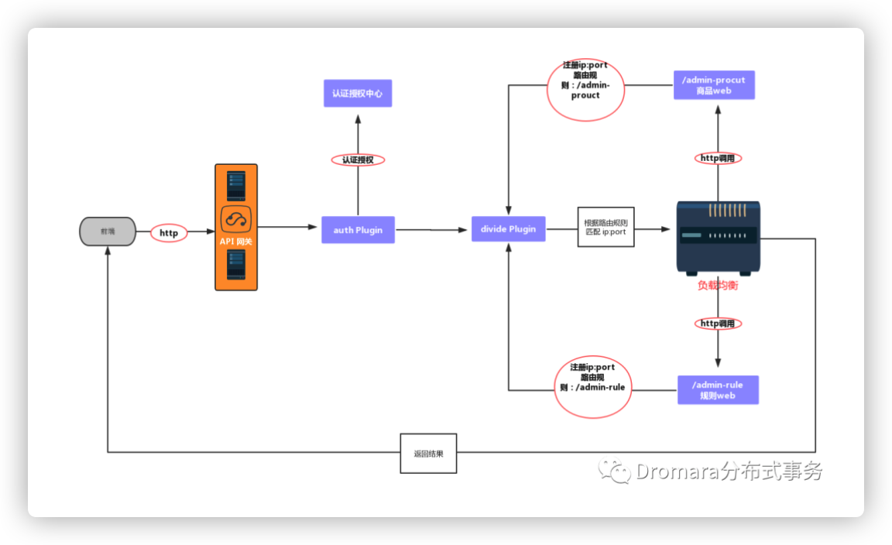

**Soul** 网关自从去年10月我开源以来，经历了一年的事情，接受到了来自社区很多朋友的建议，并进行持续不断的优化，已经提供了非常丰富的功能，很多功能都是高度自定义，可视化，高度可扩展的，现在做一个归纳总结。

**插件**  
- 提供了系统自带的各种插件，比如签名，监控，限流，熔断，http代理，dubbo代理，websocket等等。

- 支持用户快速的进行插件的自定义开发。

- 插件的所有数据，开关状态支持动态变更。

**数据同步**
- 提供了 `http长轮询`，`zookeeper`，`websocket`  三种不同的数据同步策略，让用户自由选择。
- 推荐用户使用websocket方式，最轻量，在集群环境下，效率更高。

**对于用户**
- 首先我们提供了便于用户接入的 client包，用户可以把快速的把自己的项目接入到soul 网关。
- 默认情况下，用户完全不用关心 soul网关的选择器，规则等配置。
- 用户之前的接口完全是零侵入，不需要任何更改，只是需要把访问域名改成网关的域名即可。
- 比如 dubbo用户，几乎就是http的方式完成了 http协议到 dubbo协议的互相转换。
- `soul` 使用的是http协议，那么注定它就是跨语言的，net程序员，php程序员等等，要和java进行数据交互，那么就大大的可行了。

举个列子 ，比如你有一个 dubbo接口 参数定义是一个java bean,
```
public void insert(final DubboTest dubboTest) {
}
public class DubboTest implements Serializable {
   private String id;
   private String name;
}
```
如果你使用 soul网关要发起对它的调用，你的http传参数 就是在 body 里面 传一个json字符串 ，和普通的http调用无差别。
```
{"id":"123","name":"xiaoyu"}
```

**对于开发者(程序员)**  

- 随着使用者越来越多，每个公司使用情况又不一样,soul 网关在2.1.X版本，处处留出来更多的高度自定义扩展性，让开发者，更加方便或者有信心融入进来。
- 比如，自定义插件，过滤器，dubbo参数解析器，iphost解析器，返回结果等等。。这里我着重说一下自定义返回结果。
我们知道，soul 网关默认的返回结果是：

```
{"code":200, "message ": "成功!","data" :"helloWorld!"}
```

但是，在运用 soul 网关对你的业务系统进行调用的时候，你的业务系统可能定义的结果并不是上述结构，可能你的 字段叫  msg,这样就会造成结构不一样，给前端处理带来了困扰。我们注意到了这个事情 ：https://github.com/apache/incubator-shenyu/issues/109 , 现在已经优化，用户可以定制化的来定义返回结果,具体的要看 soul 文档。

**说了这么多，吹了这么多牛逼，那么我们来看看 soul网关到底可以在什么场景下能发挥大作用。**

**后台管理web**

- 首先随便微服务的流行，我们的后台都划分成很多的微服务，我相信你们每个公司都有一个后台管理系统吧，如果我没猜错的话，他们大体上是如下架构。


- 很简单对吧，就是有个运营管理平台的web项目，去调用每个微服务，来进行后台的查看等等。随着你们业务需要的加大，可能这里需要调用的微服务越来越多，你的 `controller`越来越多，现在比如你修改了 商品模块的 接口，你要发版会造成所有其他的模块也操作不了（就是你发版影响了其他模块的使用，别杠这里只是比方，不要整蓝绿发版啥的，明白意思吧）。
如果有运营人员在操作其他模块，会不会吐槽你？

假如你是公司架构师，我说的是假如，那么你要怎么解决这个问题呢？当然，我们把这样一个大的web系统，拆分成很多小web系统，单独的进行发布，但是这样会引入一个问题，怎么统一登陆，鉴权？（很多后台管理系统还有权限的划分） ，这个时候，`soul` 网关 就能发挥重要的作用了，下面我只是列举了一下简单的调用图。



这样多方便，集成了网关，每个微服务注册到网关，网关根据路由规则来进行调用。自动发现服务，连运维配置 nginx的工作都省了，把运维的工资给你，美滋滋。
### 公司入口网关（开放平台）  
- 如果一个公司要做开放平台或者入口网关，鉴权，限流，监控，熔断肯定少不了。

- 如果贵公司是dubbo体系，开发人员写了dubbo服务后，还要傻乎乎的新增一个web项目，来提供接口给别人调用吗？

- 如果一个接口被攻击，你怎么处理呢？如果被大流量攻击，你怎么处理呢？

- 不巧，soul 在设计之初就是来干这种事情的，我们来看一下整体的架构图。


## 零零总总还有很多其他功能
- 比如支持 websocket 代理。
- 比如支持文件上传下载。

- 比如你可以自定义的开发你的插件啊。

## 最后最后

- github地址 ：https://github.com/apache/incubator-shenyu

- gitee地址 ：https://gitee.com/dromara/soul

- 文档：https://dromara.org/zh-cn/docs/soul/soul.html

- 欢迎大家关注，如果贵公司有使用到，或者需要学习交流，或者提供代码参与开发的朋友也可以加群来进行讨论 ，qq群（429951241）

- 最后 3.0 已经在进行开源了，3.0是经历过2年双11大并发场景验证过的，现在一步一步将它开源出来，希望给大家带来帮助.
